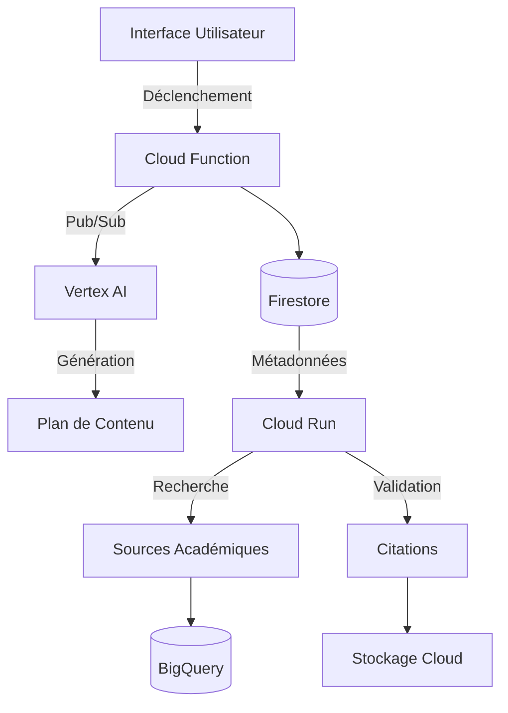
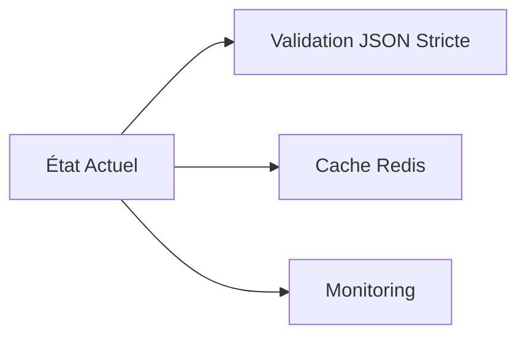

# Documentation Technique du Système de Création de Contenu IA



## 1. Fonctionnalités Principales
**Objectif** : Automatisation de la création de contenu technique avec intégration de sources académiques

**Fonctions clés** :
- ✅ Workflow en 5 étapes (Initialisation → Sélection Template → Génération Plan → Recherche Sources → Génération Finale)
- ✅ Intégration Vertex AI pour le NLP (lignes 231-235 `main.py`)
- ✅ Système de citations automatisé avec évaluation CRAAP (lignes 264-329 `app.py`)

## 2. Architecture & Conception
**Composants** :
```python
# Extrait clé de cloud_function/main.py
def initialize_content_creation(request):
    # Validation des entrées
    if not all([content_type, title]):
        return jsonify(error="Paramètres manquants"), 400
    
    # Orchestration du workflow
    publish_event('content-creation-events', {
        'content_id': content_id,
        'action': 'select_template'
    })
```

**Flux de Données** :
1. Initialisation via API REST
2. Stockage métadonnées dans Firestore
3. Génération de contenu avec Vertex AI
4. Recherche et validation des sources
5. Publication dans Cloud Storage

## 3. Dépendances & Risques
**Bibliothèques** :
- `google-cloud-firestore==2.11.1`
- `vertexai==0.4.0`
- `flask==2.2.3`

**Risques** :
- ⚠️ Configuration CORS non restrictive (absente dans `app.py`)
- ⚠️ Gestion des secrets via variables d'environnement (ligne 17 `app.py`)

## 4. Analyse de Sécurité
**Bonnes Pratiques** :
- 🔒 Validation des entrées JSON (lignes 32-36 `main.py`)
- 🔒 Gestion centralisée des erreurs (try/except globaux)

**Vulnérabilités** :
```python
# Risque potentiel dans app.py ligne 85-87
try:
    source_needs = json.loads(response.text)
except:
    # Gestion générique des erreurs
```

## 5. Améliorations Recommandées


1. Implémenter des schémas JSON avec Pydantic
2. Ajouter un système de retry pour Firestore
3. Centraliser la configuration avec Cloud Secret Manager

## 6. Documentation Manquante
- Spécifications techniques des templates de contenu
- Journalisation détaillée des appels Vertex AI
- Politique de gestion des erreurs de l'API