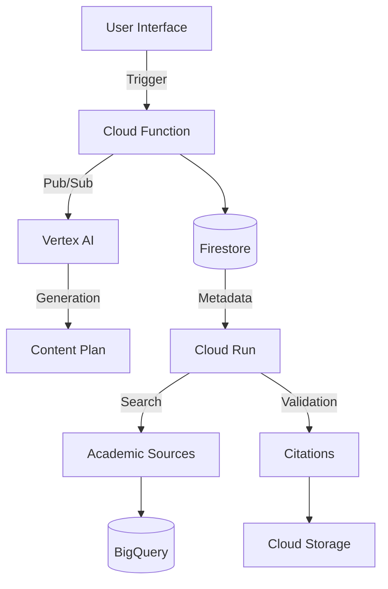
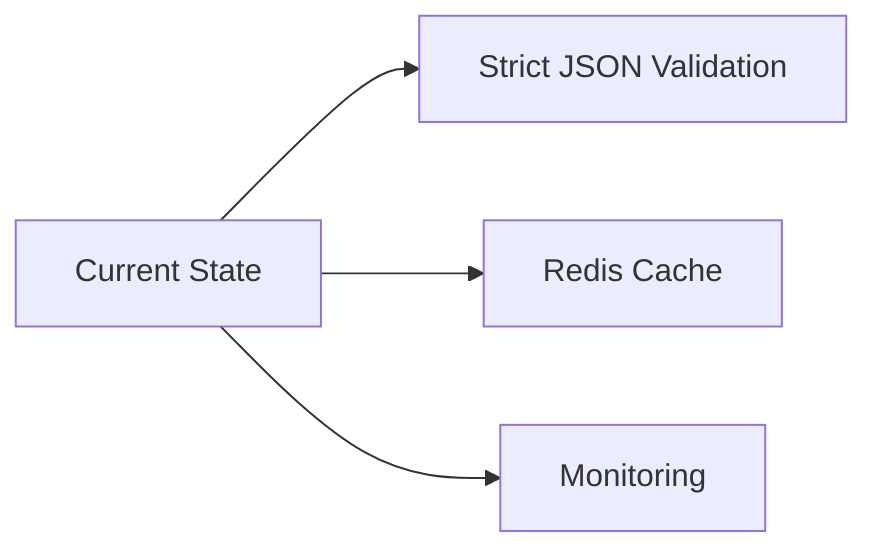

# Technical Documentation of the AI Content Creation System



## 1. Key Features
**Objective**: Automation of technical content creation with integration of academic sources

**Key Functions**:
- ✅ 5-step workflow (Initialization → Template Selection → Plan Generation → Source Search → Final Generation)
- ✅ Vertex AI integration for NLP (lines 231-235 `main.py`)
- ✅ Automated citation system with CRAAP evaluation (lines 264-329 `app.py`)

## 2. Architecture & Design
**Components**:
```python
# Key excerpt from cloud_function/main.py
def initialize_content_creation(request):
    # Input validation
    if not all([content_type, title]):
        return jsonify(error="Missing parameters"), 400

    # Workflow orchestration
    publish_event('content-creation-events', {
        'content_id': content_id,
        'action': 'select_template'
    })
```

**Data Flow**:
1. Initialization via REST API
2. Metadata storage in Firestore
3. Content generation with Vertex AI
4. Source search and validation
5. Publication in Cloud Storage

## 3. Dependencies & Risks
**Libraries**:
- `google-cloud-firestore==2.11.1`
- `vertexai==0.4.0`
- `flask==2.2.3`

**Risks**:
- ⚠️ Non-restrictive CORS configuration (missing in `app.py`)
- ⚠️ Secrets management via environment variables (line 17 `app.py`)

## 4. Security Analysis
**Good Practices**:
- 🔒 JSON input validation (lines 32-36 `main.py`)
- 🔒 Centralized error handling (global try/except)

**Vulnerabilities**:
```python
# Potential risk in app.py lines 85-87
try:
    source_needs = json.loads(response.text)
except:
    # Generic error handling
```

## 5. Recommended Improvements


1. Implement JSON schemas with Pydantic
2. Add a retry mechanism for Firestore
3. Centralize configuration with Cloud Secret Manager

## 6. Missing Documentation
- Technical specifications of content templates
- Detailed logging of Vertex AI calls
- API error management policy