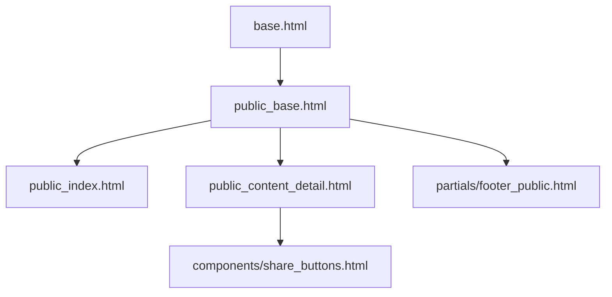

# Architecture du Portail Public

## 1. Stack Technique
- **Frontend**: 
  - Templates Jinja2 étendus (héritage de base.html)
  - HTMX pour l'interactivité légère
  - Tailwind CSS + Alpine.js pour les composants
- **Backend**:
  - Nouvelle route Flask `/public/<content_id>`
  - Cache Redis pour les articles fréquemment lus
  - Traduction automatique via LibreTranslate API

## 2. Modifications des Templates

## 3. Sécurité
- Rate limiting (100 req/min par IP)
- Sanitization Markdown avec Bleach
- CSP strict sans 'unsafe-inline'

## 4. Performance
- Pré-génération des pages statiques (SSG)
- Compression Brotli activée
- Lazy loading des images

## 5. Métriques
- Surveillance des erreurs 404
- Tracking des partages sociaux
- Audit d'accessibilité mensuel