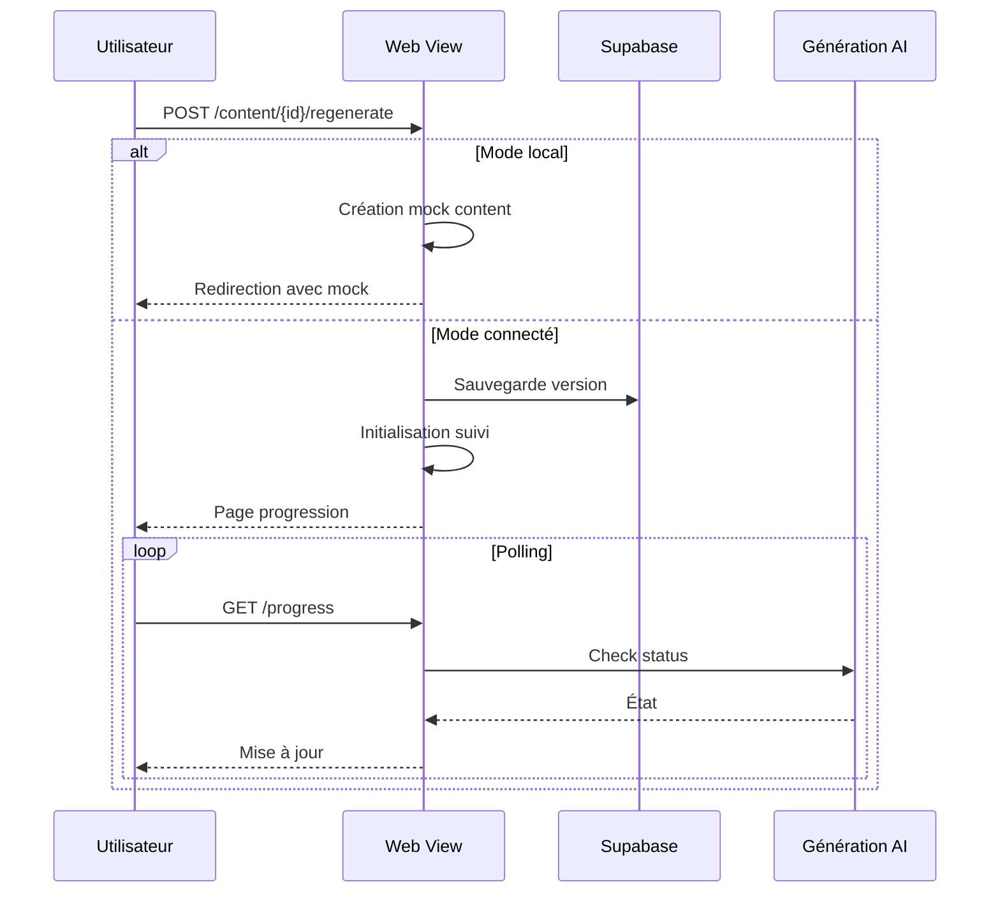

# Analyse du processus de régénération

## Workflow actuel

## Problèmes identifiés et corrections

### 1. Gestion des références
- **Problème** : Erreur `'dict' object has no attribute 'title'` dans `store_references_in_database`
- **Cause** : La fonction attendait des objets `Reference` mais recevait des dictionnaires
- **Solution** : Mise à jour pour utiliser `ref.get('title')` au lieu de `ref.title` et `ref.get('id')` au lieu de `ref.reference_id`

### 2. Retour de fonction incohérent
- **Problème** : `generate_content_for_item` dans `content_workflow_supabase.py` ne retournait pas un tuple `(success, content_text)`
- **Solution** : Mise à jour de tous les `return` pour retourner un tuple `(success, content_text)`

### 3. Paramètre manquant
- **Problème** : Paramètre `include_references` non géré dans `generate_content_for_item`
- **Solution** : Ajout du paramètre à la signature de fonction

### 4. Option "Force" non transmise
- **Problème** : L'option "Force" n'était pas correctement transmise à la fonction de génération
- **Solution** : Correction de la transmission du paramètre `force` dans le dictionnaire `generation_progress_store`

## Améliorations proposées

### 1. Implémentation de tâches asynchrones
- **Problème** : Pas de véritable background processing

- **Bénéfice** : Meilleure gestion des tâches longues et résilience en cas d'erreur

### 2. Gestion des erreurs améliorée
- **Problème** : Logging insuffisant

- **Bénéfice** : Détection proactive des problèmes et meilleure visibilité

### 3. Versioning des contenus
- **Problème** : Sauvegarde locale en fallback

- **Bénéfice** : Persistance des versions même en cas d'échec de Supabase

### 4. Monitoring des performances
- Ajouter des métriques Prometheus :
  - Temps de génération
  - Taux d'échec
  - Utilisation modèle
  - Suivi des options "Force" et "Include References"

