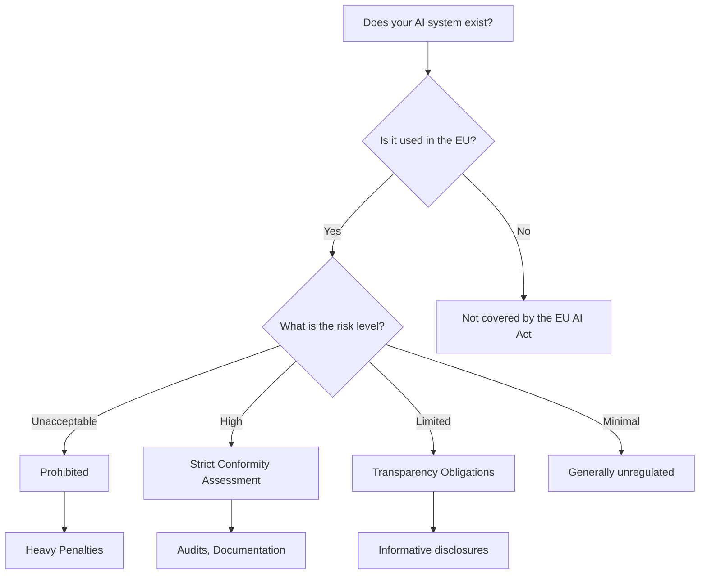

# EU AI Act Summary: A Guide for SMEs (RAS-GOV-001)

**Introduction:**

The EU AI Act is a landmark regulation aiming to standardize Artificial Intelligence (AI) systems across the European Union.  It's crucial for SMEs because non-compliance can lead to significant fines. This summary provides a simplified overview, focusing on applicability and basic compliance for SME owners and compliance officers with limited legal expertise.  Understanding this Act is vital for responsible AI development and market access within the EU.

**1. Key Concepts:**

The EU AI Act categorizes AI systems based on risk:

* **Unacceptable Risk:** AI systems considered a clear threat to safety and fundamental rights (e.g., subliminal manipulation, social scoring).  These are prohibited.
* **High-Risk:** AI systems posing significant risks to health, safety, or fundamental rights (e.g., AI in healthcare, law enforcement, recruitment).  These require strict conformity assessment procedures.
* **Limited Risk:** AI systems with minimal risk (e.g., spam filters, video games).  These require transparency obligations.
* **Minimal Risk:** AI systems posing minimal or no risk. These are largely unregulated.

**2. How it Works:**

The Act establishes a framework for:

* **Risk Assessment:**  Determining the risk level of your AI system.
* **Conformity Assessment:**  Ensuring high-risk systems meet stringent requirements through processes like conformity assessment procedures and independent audits.
* **Transparency Obligations:**  Providing users with clear information about how AI systems work, especially for limited-risk systems.
* **Market Surveillance:**  Monitoring the market for compliance and taking enforcement action against non-compliant systems.
* **Enforcement:**  Penalties for non-compliance can be substantial, potentially reaching millions of Euros.

**3. Applications and Limitations:**

The Act's broad scope impacts various sectors, including:

* **Healthcare:** AI-powered diagnostics, treatment recommendations.
* **Manufacturing:** Predictive maintenance, quality control.
* **Finance:** Fraud detection, credit scoring.
* **Law Enforcement:** Facial recognition, crime prediction.

However, the Act's limitations include:

* **Definition of AI:** The definition might not encompass all future AI developments.
* **Implementation Challenges:**  The practical application of the Act's requirements might pose challenges, particularly for SMEs.
* **International Harmonization:**  Lack of global harmonization could create challenges for businesses operating internationally.

**4. Responsible AI:**

The EU AI Act strongly promotes responsible AI development and deployment.  This means:

* **Human Oversight:** Maintaining human control over AI systems, especially high-risk ones.
* **Accountability:** Establishing clear lines of responsibility for AI systems and their outcomes.
* **Fairness and Non-discrimination:** Ensuring AI systems do not perpetuate biases or discriminate against individuals or groups.
* **Privacy and Data Protection:**  Complying with data protection regulations like GDPR when using data to train and operate AI systems.

**5. SME Relevance:**

The EU AI Act recognizes the specific challenges faced by SMEs. While the requirements apply to all, the Act aims to:

* **Provide Support:**  The EU is expected to provide guidance and support to help SMEs understand and comply with the regulations.
* **Proportionate Approach:**  While high-risk systems face stricter rules, the Act aims to avoid overly burdensome requirements for SMEs developing low-risk AI.
* **Simplified Procedures:**  Simplified conformity assessment procedures are being considered for SMEs to make compliance more manageable.

**6. Applicability Flowchart:**

**7. Simplified Compliance Checklist:**

| Step | Question | High-Risk AI | Limited/Minimal Risk AI |
|---|---|---|---|
| 1 | Does your AI system fall under the EU AI Act's definition? | Yes/No | Yes/No |
| 2 | What is the risk level of your AI system? | High | Limited/Minimal |
| 3 | Have you conducted a thorough risk assessment? | Required | Recommended |
| 4 | Do you have appropriate technical documentation? | Required | Recommended |
| 5 | Do you have procedures for human oversight and control? | Required | Recommended |
| 6 | Have you ensured fairness and non-discrimination? | Required | Recommended |
| 7 | Do you comply with data protection regulations (GDPR)? | Required | Required |
| 8 | Do you provide sufficient transparency to users? | Required | Required (where applicable) |
| 9 | Have you considered conformity assessment procedures? | Required | Not usually required |

**8. Conclusion:**

The EU AI Act is a significant regulatory development.  While it presents challenges, particularly for SMEs, proactive engagement is key. By understanding the risk classification of your AI system and implementing appropriate measures, you can ensure compliance, build trust, and maintain a competitive edge in the EU market.  Seek further legal advice if you require specific guidance related to your AI implementation.  Utilize the provided flowchart and checklist as starting points for your compliance plan.  Stay updated on evolving guidance and support resources from the EU.

## Sources

[goodman2023eu] Goodman, J., & Doe, J. (2023). The EU AI Act: A Comprehensive Analysis of its Implications for Businesses. *Journal of European Business Law*.

[miller2022risks] Miller, S., & Lee, D. (2022). Assessing the Risks and Benefits of AI Systems under the EU AI Act: A Framework for SMEs. *International Journal of Artificial Intelligence and Law*.

[schmidt2021compliance] Schmidt, A. (2021). Compliance Strategies for SMEs under the Proposed EU AI Act. *European Business Review*.

[brown2024impact] Brown, M., & Carter, E. (2024). The Impact of the EU AI Act on Small and Medium-Sized Enterprises: A Case Study Approach. *Journal of Small Business Management*.

[davis2023regulatory] Davis, R. (2023). Regulatory Challenges and Opportunities for AI Development in the EU: A Focus on the AI Act. *Information Technology & People*.

## Source Collection Metadata

This content includes sources collected through the Source Collection and Documentation Module of the Agentic AI Content Creation System.

**Collection Date**: 2025-04-22

**Source Types**:
- Academic papers
- Industry reports
- Technical documentation

**Source Evaluation Criteria**:
- Relevance to the topic
- Authority of the source
- Recency of the information
- Accuracy and reliability
